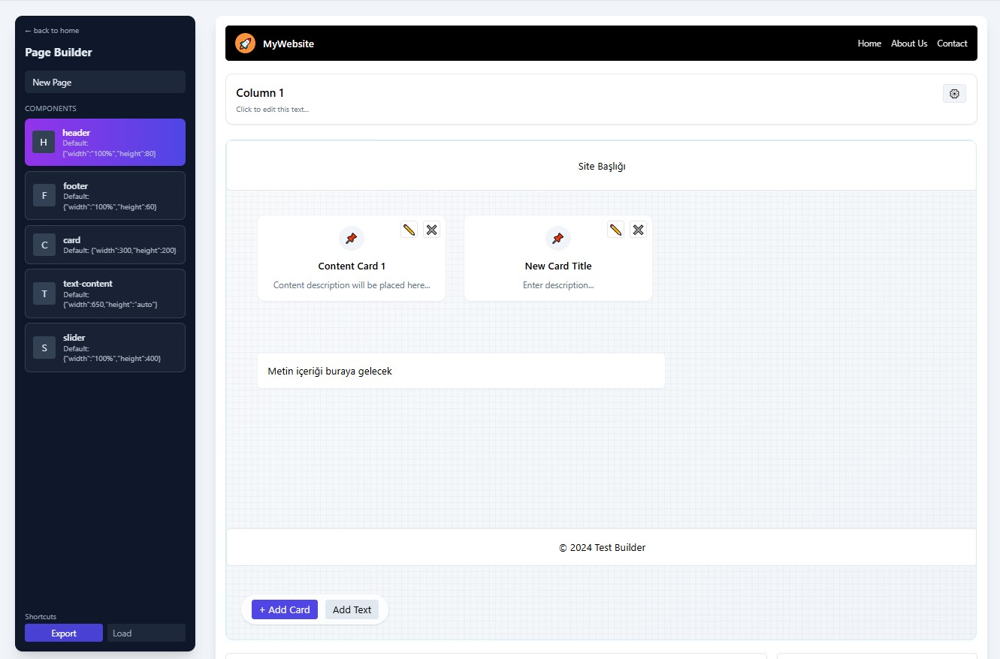

# React + TypeScript + Vite + TailwindCSS Starter

This is a starter project template for building React applications using **TypeScript**, **Vite**, and **TailwindCSS**.  
It comes pre-configured for fast development with hot module replacement and modern frontend tooling.

---

## Features

- React 18 with functional components
- TypeScript support for type safety
- Vite for fast bundling and dev server
- TailwindCSS for utility-first styling
- Easy setup for future components and layouts

---

## Getting Started

### Prerequisites

Make sure you have **Node.js 18+** and **npm** (or **yarn/pnpm**) installed.

### Installation

```bash
# Clone the repository
git clone https://github.com/AbdullahSeraj/TEST-BUILDER---TEST-CASE.git
cd TEST-BUILDER---TEST-CASE

# Install dependencies
npm install
```
